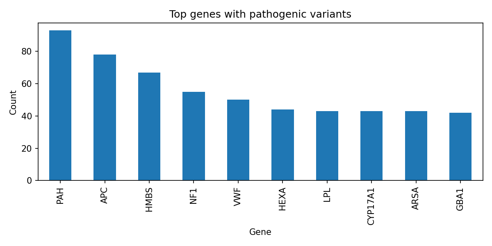

# ClinVar Variant Analysis

Pathogenic genetic variants provide critical insights into disease mechanisms and potential therapeutic targets. This project examines publicly available ClinVar data to identify genes that are most frequently associated with pathogenic variants, demonstrating how simple data analysis workflows can reveal biologically meaningful patterns.

Rather than focusing on building a complex bioinformatics pipeline, the emphasis is on clarity, interpretability, and extracting relevant insights from real-world genomic data.

## Background

Understanding which genes are disproportionately affected by pathogenic variants is central to genetics and biomedical research. Such genes are often involved in critical biological processes and may play a key role in disease mechanisms.

ClinVar is a widely used public database that aggregates information about genomic variation and its relationship to human health. By analyzing this dataset, it is possible to highlight genes that repeatedly appear in clinically relevant contexts.

## Biological Context: Gene Function, Mutations, and Disease Mechanisms

The most frequently observed genes in this analysis are well-established contributors to human disease. Below is a concise overview of their genomic location, mutation types, and biological impact.

- **PAH (Chr 12)**  
  Mutations are typically missense variants that reduce enzymatic activity. These arise from point mutations in the coding sequence. Impaired phenylalanine hydroxylase function leads to phenylalanine accumulation, causing neurotoxicity in phenylketonuria (PKU).

- **APC (Chr 5)**  
  Frequently affected by truncating mutations (nonsense or frameshift), often arising from replication errors or inherited variants. Loss of APC function disrupts Wnt signaling regulation, promoting uncontrolled cell proliferation and colorectal tumor formation.

- **HMBS (Chr 11)**  
  Mutations include missense and splicing defects that impair enzyme stability. These mutations arise from nucleotide substitutions affecting heme biosynthesis. The resulting enzymatic deficiency leads to accumulation of toxic intermediates, causing acute intermittent porphyria.

- **NF1 (Chr 17)**  
  Typically affected by loss-of-function mutations (nonsense, frameshift, or deletions). These mutations impair neurofibromin, a regulator of Ras signaling. Loss of regulation leads to increased cell growth and tumor development in neurofibromatosis type 1.

- **VWF (Chr 12)**  
  Mutations include missense and structural variants affecting protein folding or secretion. These arise from point mutations or larger genomic rearrangements. Defective von Willebrand factor impairs platelet adhesion, leading to bleeding disorders.

- **HEXA (Chr 15)**  
  Commonly affected by missense or insertion mutations. These mutations disrupt lysosomal enzyme activity. Accumulation of GM2 gangliosides in neurons leads to progressive neurodegeneration in Tay–Sachs disease.

- **LPL (Chr 8)**  
  Mutations are often missense variants that reduce enzyme activity or stability. These arise from single nucleotide changes affecting lipid metabolism. Impaired lipoprotein lipase function leads to triglyceride accumulation and metabolic disease.

- **CYP17A1 (Chr 10)**  
  Mutations include missense and loss-of-function variants affecting steroidogenic enzymes. These arise from coding sequence alterations. Disrupted hormone synthesis leads to endocrine disorders such as congenital adrenal hyperplasia.

- **ARSA (Chr 22)**  
  Mutations are typically missense variants affecting enzyme folding and activity. These arise from nucleotide substitutions. Loss of arylsulfatase A function causes accumulation of sulfatides, leading to demyelination in metachromatic leukodystrophy.

- **GBA1 (Chr 1)**  
  Commonly affected by missense mutations that impair lysosomal enzyme function. These mutations arise from point mutations in coding regions. Reduced glucocerebrosidase activity leads to lipid accumulation, causing Gaucher disease and increasing Parkinson’s disease risk.

## Approach

The analysis follows a straightforward and transparent workflow implemented in Python:

- ClinVar variant data is loaded and filtered
- Pathogenic variants are selected
- Variant counts are aggregated at the gene level
- The most frequently affected genes are visualized

This minimal approach illustrates how even simple data processing steps can uncover biologically meaningful patterns without requiring heavy computational infrastructure.

## Results and Interpretation

The results show that pathogenic variants are not evenly distributed across genes. Instead, certain genes appear much more frequently, reflecting their importance in disease-related processes.

These genes represent strong candidates for further investigation in areas such as disease mechanism studies, functional genomics, and therapeutic development. While this analysis does not directly evaluate gene editing strategies, the identified genes may serve as potential targets for future research, including applications in CRISPR-based therapies.

## Example Output

The visualization highlights the top genes most frequently associated with pathogenic variants, providing an intuitive overview of their relative importance.

## Project Structure

- `notebook/01_clinvar_analysis.ipynb` – main analysis notebook  
- `data/variant_summary.txt.gz` – ClinVar dataset (not tracked in Git)  
- `figures/clinvar_top_genes.png` – generated visualization  

## Future Work

Future extensions of this project could include integrating additional clinical annotations, incorporating variant pathogenicity scores, and applying more advanced statistical or machine learning methods to prioritize candidate genes.

## Key Takeaway

Even a lightweight and interpretable analysis of public genomic data can highlight biologically important genes and provide a foundation for more advanced studies in genetics and gene therapy.